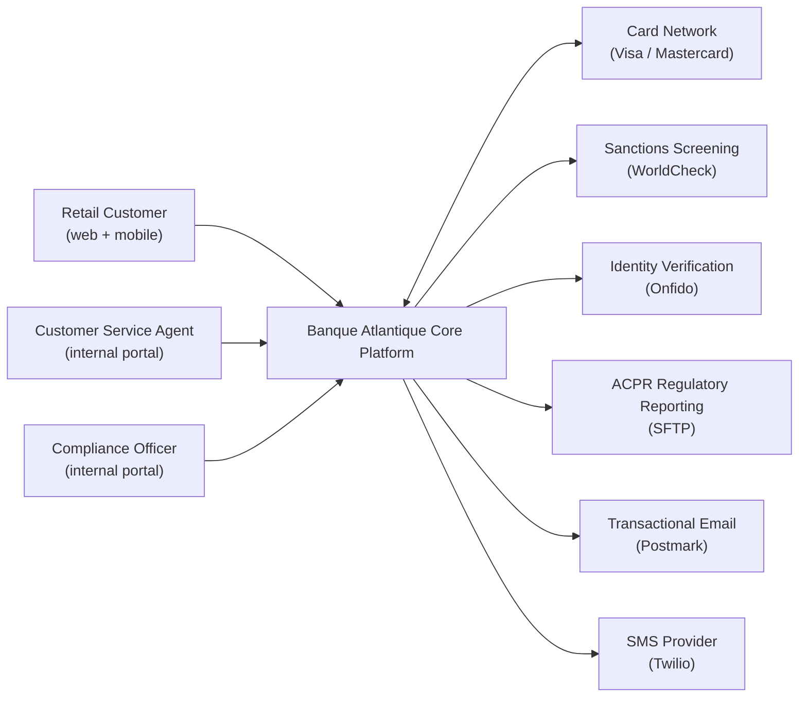
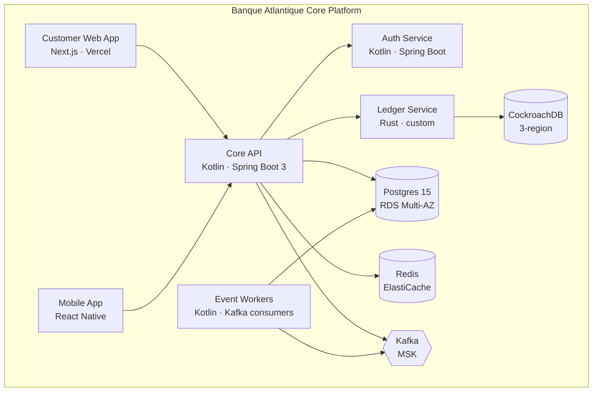
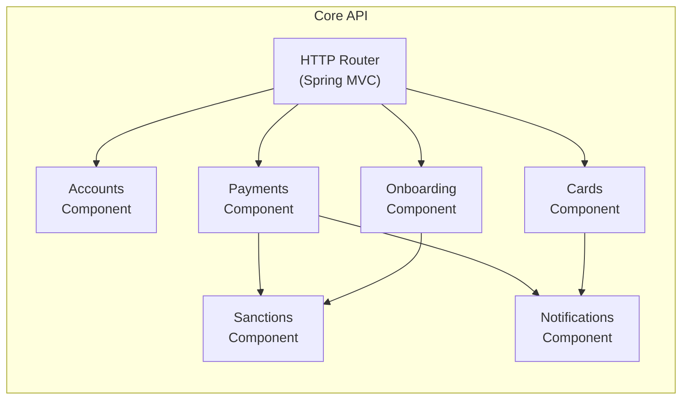
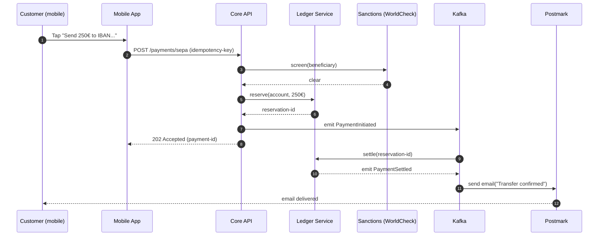

# Sample: ARCH dossier for fictional EU fintech

**Source prompt:** `ARCH.md`
**Engagement:** Architecture Dossier for "Banque Atlantique" (fictional
French neobank with ~250k retail customers, preparing for ISO 27001
certification + DORA compliance evidence; engineering team of 40).

All entities and findings are **fictional**. Demonstrates C4 model
applied via Mermaid (renders in GitHub / pandoc), ADRs in Nygard
format, and the gap-flagging discipline.

---

# Architecture Dossier — Banque Atlantique Core Platform

**Client:** Banque Atlantique S.A.
**Date:** 2026-05-11   **Commit:** `core-platform @ d3e9a1f4`
**Audience:** ISO 27001 lead auditor + internal Eng team onboarding

---

## 1. System Context  (C4 Level 1)

System purpose: hold deposits, process payments, issue cards,
support customer service and compliance operations for retail
customers in France + Belgium + Netherlands.

---

## 2. Containers  (C4 Level 2)

| Container | Runtime | Responsibility | Data owned |
|---|---|---|---|
| Customer Web App | Next.js 14 / Vercel | Customer-facing UX | None (stateless) |
| Mobile App | React Native | Customer-facing mobile UX | Local secure storage |
| Core API | Kotlin / Spring Boot 3 / ECS Fargate | Customer-facing business logic | Customer records, sessions |
| Ledger Service | Rust / custom binary / EKS | Money movement, double-entry bookkeeping | Account balances, postings |
| Auth Service | Kotlin / Spring Boot / ECS | Authentication, MFA, session | Credentials, MFA tokens |
| Event Workers | Kotlin / Kafka consumers / ECS | Async processing (notifications, reporting) | Stateless |
| Postgres (RDS) | Multi-AZ in eu-west-3 | Customer + reference data | Customers, cards, applications |
| CockroachDB | 3-region (Paris, Frankfurt, Amsterdam) | Ledger storage with consensus | Account postings (source of truth) |
| Redis (ElastiCache) | Multi-AZ | Session cache, rate limiting | Sessions, ephemeral state |
| Kafka (MSK) | Multi-AZ | Event stream | Event log |

---

## 3. Components — Core API container  (C4 Level 3, one container shown)

Each component lives in `core-api/src/main/kotlin/io/atlantique/<name>/`.

---

## 4. Data Flows

### Scenario: Customer makes a SEPA transfer

Entry points (cite `core-api/src/.../`):
- Step 2: `payments/api/SepaController.kt:42`
- Step 3: `sanctions/SanctionsClient.kt:18`
- Step 4: `payments/service/PaymentReservationService.kt:78`

Two more scenarios in full delivery: "card issuance", "monthly
regulatory report generation".

---

## 5. Decision Records (ADRs)

### ADR-007: CockroachDB for the ledger (not Postgres)
**Status:** Accepted (2024-Q3)
**Context:** The ledger is the system's source of truth for money;
SLA target is 99.99% availability + zero data loss. Multi-region
synchronous replication is required for regulatory continuity
under DORA Art. 11.
**Decision:** Use CockroachDB with synchronous replication across
3 EU regions; accept the latency cost (writes ~30ms higher than
single-region Postgres).
**Consequences:**
- (+) Survives any single-region AWS outage with zero RPO
- (+) Strong consistency simplifies ledger invariants
- (–) Higher operational cost (~€8k / month)
- (–) Team needed CockroachDB-specific learning curve
**Evidence:** `infrastructure/cockroachdb/terraform/` + commit
`8a3f7c2` (initial deployment).

### ADR-012: Synchronous sanctions screening before payment release
**Status:** Accepted (2024-Q4)
**Context:** EU AML 6 directive requires real-time sanctions
screening before payment release. Asynchronous screening
with hold-and-release was considered but adds 5-15 second customer
latency.
**Decision:** Synchronous call to WorldCheck before payment is
accepted; <2s timeout; on timeout, queue the payment for manual
review (pessimistic safety).
**Consequences:**
- (+) Customer experience: rejection happens immediately
- (+) No funds at risk between screening and release
- (–) Tight coupling to WorldCheck availability — separate
  contingency runbook required
**Evidence:** `payments/service/SanctionsCheck.kt:34` +
`docs/runbooks/sanctions-outage.md`.

[8 more ADRs in full delivery covering: customer-data partitioning,
PII tokenisation strategy, MFA enrolment flow, event-stream schema
governance, etc.]

---

## 6. Runtime & Operations

- **Deployment:** GitHub Actions → AWS ECS Fargate (Core API,
  Auth) + EKS (Ledger). Blue-green per service, automated rollback
  on health-check failure.
- **Observability:** Datadog APM + logs; CloudWatch metrics
  baseline; PagerDuty for on-call.
- **SLOs:**
  - Customer-facing API availability: 99.95% / month
  - Payment latency p99 < 5s end-to-end
  - Ledger availability: 99.99% / month
- **DR:** Tested quarterly. RPO 0 (ledger), RTO 4h (other services).
- **Secrets:** AWS Secrets Manager + IRSA. Rotation: 90 days
  automated for service accounts, manual for vendor APIs.

---

## 7. Risks & Gaps

| ID | Risk | Evidence |
|---|---|---|
| R-1 | Single point of failure: WorldCheck (sanctions) | `payments/service/SanctionsCheck.kt:34` — no fallback provider |
| R-2 | Postgres TDE-at-rest enabled, but app-layer encryption for sensitive PII columns inconsistent | `customers/model/Customer.kt:18-44` — some fields encrypted, some not |
| R-3 | No automated runbook for ledger region failover; documented but manual | `docs/runbooks/ledger-failover.md` |
| R-4 | Mobile app does not implement certificate pinning | `mobile/src/lib/api/client.ts:12` |
| R-5 | Auth Service relies on a 2-person team; bus factor concern | Last 12 months: 84% of `auth-service/` commits by 2 engineers |

---

## 8. Limitations

This dossier was produced by an AI agent from static analysis of
the repository at commit `d3e9a1f4` on 2026-05-11. ADR rationales
marked `[inferred]` should be confirmed with the engineering team
before publication. Diagrams reflect the code structure; runtime
behaviour under load, failover paths, and operational procedures
not captured in code are outside the scope of this document. For
compliance use (ISO 27001 §A.8.27, DORA Art. 6) treat this as a
draft to be reviewed and signed off by the system owner.

[Full disclaimer per `_LEGAL/AUDIT-DISCLAIMER.md`]

---

*Report length in actual delivery: 48 pages. Sample shows ~20%
including all four C4 levels, one data flow, two ADRs, and risks.
Engagement fee: €11 000. Dossier was submitted to ISO 27001
auditor as primary evidence for §A.8.27; passed without
substantive comment.*
